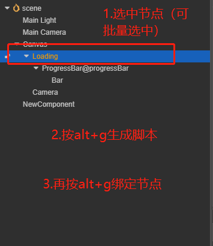

# 项目简介

拖拽绑定ui的方式太慢了，不如试试这个一键绑定插件

## 开发环境

Node.js

## 安装

```bash
# 安装依赖模块
npm install
# 构建
npm run build
```

## 用法

将需要绑定的节点按以下方式命名
#### [组件键值]@[成员名称]
#### 例如：
    ProgressBar@progressBar
    Button@startBtn
可绑定的组件类型定义在 Const.ts 中，可以自由更改，改完记得构建

选中根节点 按快捷键 alt+g 生成脚本
再按一次 alt+g 绑定

